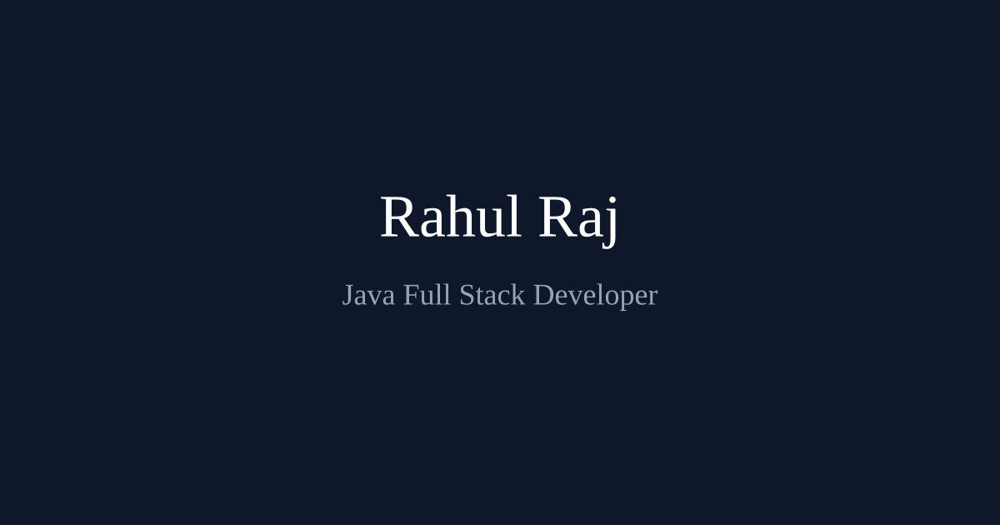

<div align="center">



# Rahul Raj

### Java Full Stack Developer · Hyderabad, India

[](https://rahulrajonline.in)
[](https://www.linkedin.com/in/sayrahulraj/)
[](https://github.com/sayrahulraj)
[](mailto:rahulrajonline.ai@gmail.com)
[](src/assets/resume/Rahul_Raj_Resume.pdf)

</div>

<br />

This repository holds the source for my personal portfolio: a single-page site where I showcase my experience, skills, projects, and certifications.

## About Me

Java Full Stack Developer with 5.5+ years building scalable microservices and Angular front ends for global fintech, banking, and healthcare clients. Skilled in Spring Boot, Kafka, and cloud-native architectures, with a growing focus on AI-assisted engineering to boost delivery velocity.

<div align="center">


</div>

## 🧭 What's on the Site

| Section | Highlights |
|---|---|
| 🏠 **About** | Background, career timeline, and highlights |
| 🛠️ **Skills** | Grouped by language & framework, architecture, frontend, API security, data & caching, DevOps, testing, collaboration, and AI-augmented tooling |
| 💼 **Experience** | Infosys and Tata Consultancy Services, and the client engagements behind them (Fiserv, Cardinal Health, State Farm) |
| 🚀 **Projects** | Personal builds outside of client work |
| 🏆 **Certifications** | Anthropic's Claude Certified Architect (Foundations & Professional), AWS Certified Cloud Practitioner, NPTEL coursework, and more |
| ✉️ **Contact** | A working form (no backend needed) plus direct email, phone, and social links |

---

<details>
<summary><strong>🔧 Running it locally</strong></summary>
<br />

Built with **Angular 19**.

```bash
npm install
npm start
```

Then open `http://localhost:4200`.

</details>

<br />

<sub>This is my personal portfolio — please don't reuse the content or resume as your own.</sub>
